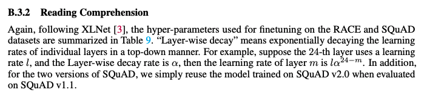

# 使用PaddlePaddle复现论文： Funnel-Transformer: Filtering out Sequential Redundancy for Efficient Language Processing
## Funnel

[Funnel-Transformer: Filtering out Sequential Redundancy for Efficient Language Processing](https://arxiv.org/pdf/2006.03236.pdf)

**摘要：**
本项目是 [Funnel Pytorch版本](https://github.com/huggingface/transformers/tree/master/src/transformers/models/funnel)  在 Paddle 2.x上的开源实现。

复现思路：
1. 实现了[Paddorch库](https://github.com/zzz2010/paddorch) 把Pytorch 接口在 Paddle实现实现
2. 实现了[HF_paddle库](https://gitee.com/littledesk/hf_transformers_paddle) 把huggingface_transformer 接口在Paddorch/Paddle上实现
3. 封装了HF_paddle库中Funnel模型（原huggingface 接口）在paddlenlp中


## 原论文效果
"funnel-transformer/xlarge"**模型指标**：

> QNLI验证集上accuracy=95.1%（见论文table 3），
> SQuAD v1.1验证集上F1/EM=94.7/89.0，SQuAD v2.0验证集F1/EM=90.4/87.6（见论文table 5）

##  复现结果

> QNLI验证集上accuracy=95.277%
>
> SQuAD v1.1验证集上F1/EM=94.25/89.0，SQuAD v2.0验证集F1/EM=89.70/87.6（见论文table 5）


## 环境安装

```bash
# 克隆本仓库
# 进入paddlenlp目录
cd paddlenlp
# 本地安装
pip install -r requirements.txt
pip install -e .
# 返回初始目录
cd ..
##安装 Paddorch
cd paddorch
pip install -r requirements.txt
pip install -e .
##安装 HF_paddle
cd hf_paddle
pip install -r requirements.txt
pip install -e .

```

## 快速开始

### （一）模型精度对齐
运行`python compare.py`，对比huggingface与paddle之间的精度，我们可以发现精度的平均误差在10^-7量级，最大误差在10^-6量级。
```python
python compare.py
# huggingface funnel-transformer/xlarge vs paddle funnel-transformer/xlarge
# mean forward psas difference: tensor(3.7627e-07, grad_fn=<MeanBackward0>)
# max forward pass difference: tensor(5.7220e-06, grad_fn=<MaxBackward1>)
# mean backward psas difference: 1.6635152e-08
# max backward pass difference: 0.00035858154
```
### （三）模型转换
模型转换需要安装pytorch， 执行`convert.py` , 会自动下载原来这的huggingface 模型，转换为paddle 模型
```python
python convert.py
```

十个预训练模型模型下载链接:[Baidu AI Studio 数据集](https://aistudio.baidu.com/aistudio/datasetdetail/105023)或[Google drive](https://drive.google.com/drive/folders/1eo2Jq0xDd7qO_9-N5lf42WsqQSi7i9aS?usp=sharing)。


### （三）模型finetune

#### 1、GLUE
以QNLI数据集为例

##### （1）模型微调：

```shell
export TOKENIZERS_PARALLELISM=true;
export PYTHONPATH=$PYTHONPATH:/home/aistudio/external-libraries:/home/aistudio/funnel_paddle/paddlenlp; 
cd funnel_paddle/glue/;\
 python run_glue.py \
 --model_name_or_path  ~/xlarge \
 --task_name qnli \
 --batch_size 24 \
 --learning_rate 1e-5 \
 --num_train_epochs=4
```

```shell
export TOKENIZERS_PARALLELISM=true;
export PYTHONPATH=$PYTHONPATH:/home/aistudio/external-libraries:/home/aistudio/funnel_paddle/paddlenlp; 
cd funnel_paddle/glue/;\
 python run_glue.py \
 --model_name_or_path  ～/qnli_ft_model_best \
 --task_name qnli \
 --batch_size 24 \
 --learning_rate 1e-5 \
 --num_train_epochs=4
```
**模型以及AI Studio log文件链接**(这个链接QNLI任务微调后的权重)

Baidu网盘链接: https://pan.baidu.com/s/1Sz7BaAbbA4tUAlmPbRsemw  密码: 5kku


##### （2）模型预测：
```bash
export TOKENIZERS_PARALLELISM=true;
export PYTHONPATH=$PYTHONPATH:/home/aistudio/external-libraries:/home/aistudio/funnel_paddle/paddlenlp; 
cd funnel_paddle/glue/;python  run_predict.py \
--ckpt_path ~/funnel_paddle/glue/qnli/qnli_ft_model_best1 \
--task_name qnli \
--batch_size 24
```

##### （3）验证结果

```shell
export TOKENIZERS_PARALLELISM=true;
export PYTHONPATH=$PYTHONPATH:/home/aistudio/external-libraries:/home/aistudio/funnel_paddle/paddlenlp; 
cd funnel_paddle/glue/;python  run_glue.py \
--model_name_or_path  ~/funnel_paddle/glue/qnli/qnli_ft_model_best \
--task_name qnli \
--batch_size 24 \
--learning_rate 1e-5 \
--num_train_epochs 0

# 验证结果
# eval loss: 0.101753, acc: 0.9527732015376167
```

#### 2、SQuAD v1.1 以及 SQuAD v2.0



论文中说明，本文的结果是直接用SQuAD v2.0的模型在SQuAD v1.1上进行验证，因此下面只说明SQuAD v2.0的训练过程。使用转换的预训练模型xlarge运行SQuAD v2.0数据集的Fine-tuning

##### （1）模型微调：

```shell
export TOKENIZERS_PARALLELISM=true;
export PYTHONPATH=/home/aistudio/external-libraries:/home/aistudio/funnel_paddle/paddlenlp:$PYTHONPATH; 
cd funnel_paddle/squad1.1/;python run_squad_v1.py \
--do_train \
--do_predict \
--learning_rate 1e-5  \
--batch_size 4 \
--model_name_or_path  ~/xlarge \
--version_2_with_negative
```

```shell
export TOKENIZERS_PARALLELISM=true;
export PYTHONPATH=/home/aistudio/external-libraries:/home/aistudio/funnel_paddle/paddlenlp:$PYTHONPATH; 
cd funnel_paddle/squad1.1/;python run_squad_v1.py \
--do_train \
--do_predict \
--learning_rate 1e-5  \
--batch_size 4 \
--model_name_or_path  outputs/best \
--version_2_with_negative
```

**模型以及AI Studio log文件链接**(这个链接SQuAD v2.0任务微调后的权重)

Baidu网盘链接: https://pan.baidu.com/s/1Sz7BaAbbA4tUAlmPbRsemw  密码: 5kku

##### （2）模型评估

训练过程中模型会自动对结果进行评估，其中最好的结果如下所示：（详细训练可查看logs文件夹）

```python
# SQuAD v1.1
{
  "exact": 88.37275307473983,
  "f1": 94.25058583243572,
  "total": 10570,
  "HasAns_exact": 88.37275307473983,
  "HasAns_f1": 94.25058583243572,
  "HasAns_total": 10570
}

# SQuAD v2.0
{
  "exact": 86.75987534742694,
  "f1": 89.70414937683252,
  "total": 11873,
  "HasAns_exact": 82.70917678812415,
  "HasAns_f1": 88.60616827785663,
  "HasAns_total": 5928,
  "NoAns_exact": 90.79899074852817,
  "NoAns_f1": 90.79899074852817,
  "NoAns_total": 5945,
  "best_exact": 87.13888654931357,
  "best_exact_thresh": -1.168607234954834,
  "best_f1": 89.9986913838358,
  "best_f1_thresh": -0.9934439659118652
}
```


#### Credit:
- 这个复现repo是在“我们的名字刚好十个字”的[convbert](https://github.com/JunnYu/paddle_convbert) 基础上修改的，在此鸣谢。 